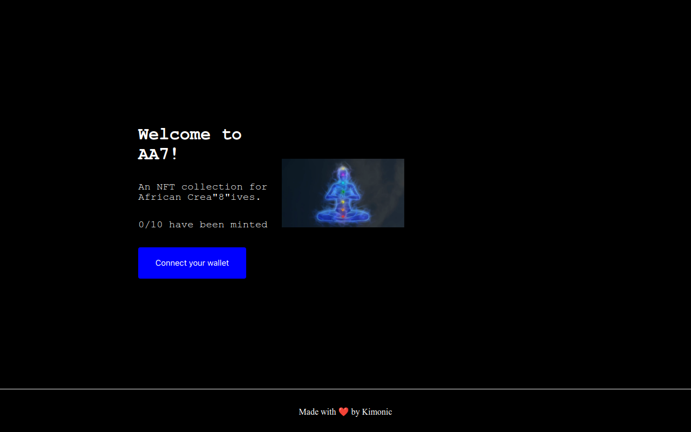

# 💎 A full NFT collection

### [LIVE SITE ](https://nft-afro-art-collection.vercel.app/) ⏩ https://nft-afro-art-collection.vercel.app/

## Project Description:
This project is an NFT Collection of on-chain non-fungible token collection implemented on the Goerli testnet.
It allows users to collect, trade, and manage their NFTs in a secure and decentralized environment

## Requirements:
- There should only exist 10 NFT's and each one of them should be unique.
- User's should be able to mint only 1 NFT with one transaction.
- Whitelisted users, should have a 5 min presale period before the actual sale where they are guaranteed 1 NFT per transaction.
- There should be a website for your NFT Collection.

## Technologies Used:
This project utilizes Ethereum, Solidity, and JavaScript. 
Ethereum is a blockchain-based platform for smart contracts and decentralized applications. 
Solidity is a programming language used to write smart contracts for Ethereum. 
Finally, JavaScript is used to interact with the Ethereum blockchain and Uniswap contract.
The frontend was developed using Next framework and the backend is in solidity.

## Project Demo 🎥


## Directory Structure 📂
- `hardhat/contracts` ⏩ Smart Contract Code [Deployed @ Goerli Test Network]
- `frontend` ⏩ Project's React frontend.

## Run this project locally 🏃🏾‍♂️💨

```shell
git clone https://github.com/Kimonic99/nft-afro-art-collection.git
```

### Frontend 🎨🖌

- `cd frontend`
- `npm install` Install Dependencies
- `npm run dev` Start the frontend in localhost 
- Open `http://localhost:3000` <br />
We can use the localhost frontend to interact with the smart contract on Goerli Network

### Backend 🔗

- `cd hardhat`
- `npm install` Install Dependencies
- `npx hardhat --version` Check if Hardhat is properly installed 
- `npx hardhat compile` Compile the Smart Contract
- `npx hardhat test` Test the Smart Contract Locally
- `npx hardhat run scripts/deploy.js` Deploy the Smart Contract Locally


### 💎 Contract Address 💎
[🚀  0xE7e9eAF9625BC8b1AAD318D0E3c0D02A0B78F83B 🛸](https://goerli.etherscan.io/address/0xE7e9eAF9625BC8b1AAD318D0E3c0D02A0B78F83B)
